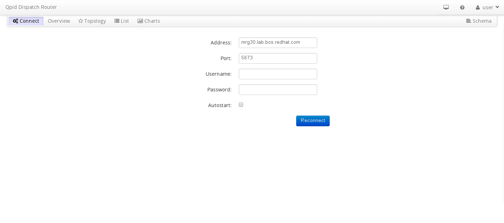
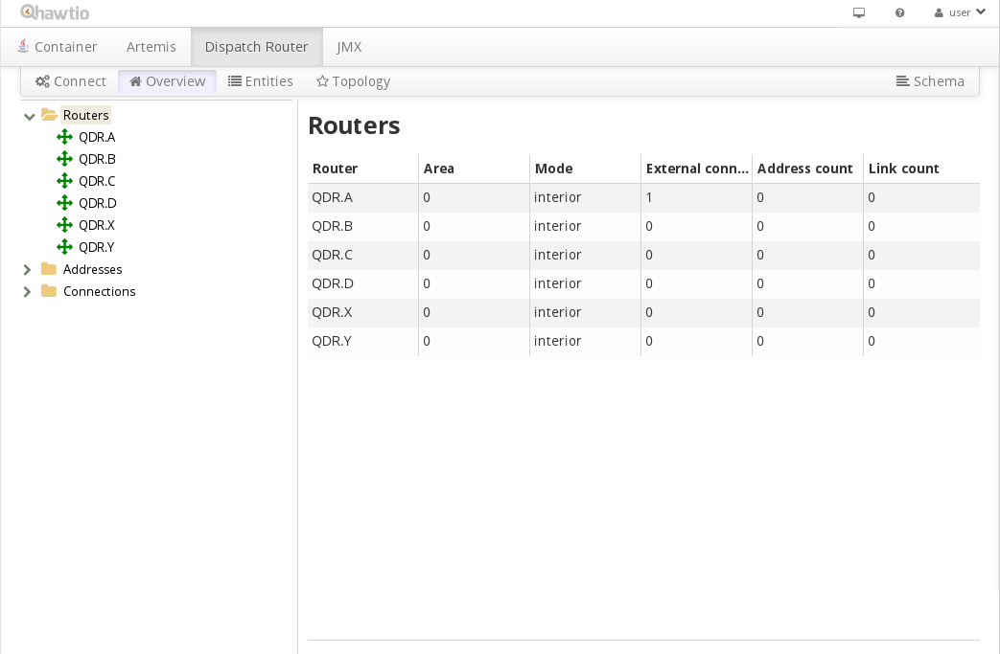
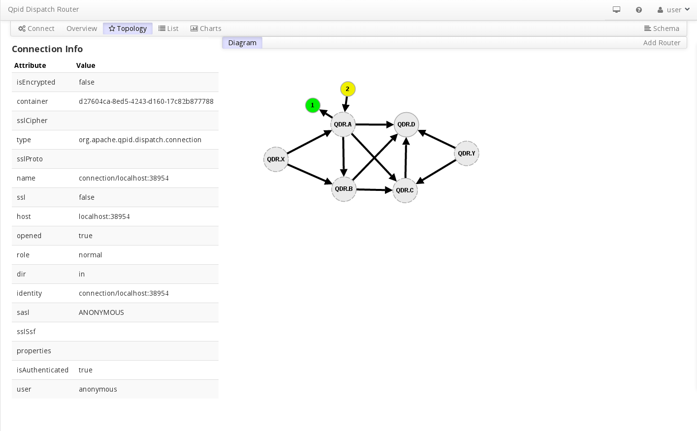
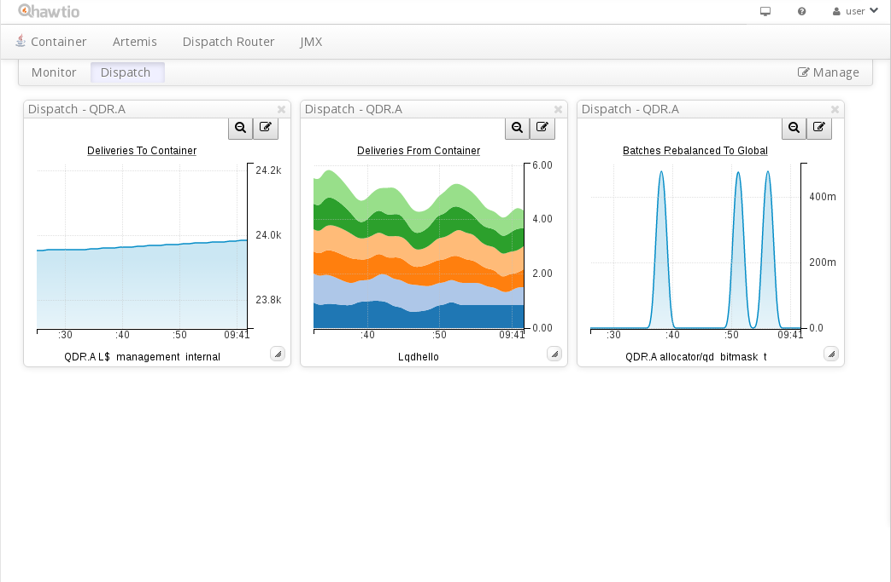
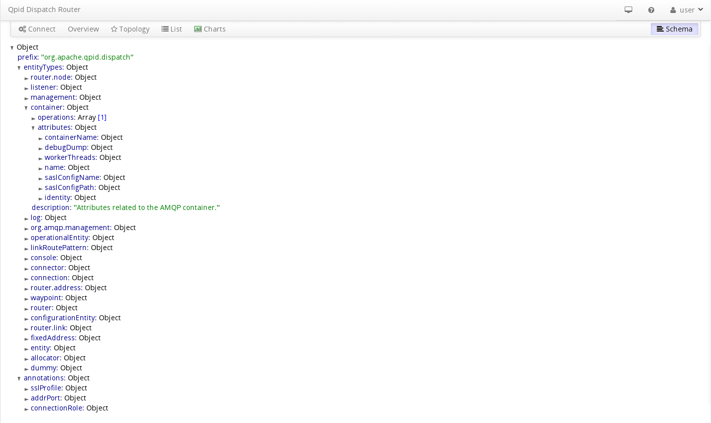

.. Licensed to the Apache Software Foundation (ASF) under one
   or more contributor license agreements.  See the NOTICE file
   distributed with this work for additional information
   regarding copyright ownership.  The ASF licenses this file
   to you under the Apache License, Version 2.0 (the
   "License"); you may not use this file except in compliance
   with the License.  You may obtain a copy of the License at

     http://www.apache.org/licenses/LICENSE-2.0

   Unless required by applicable law or agreed to in writing,
   software distributed under the License is distributed on an
   "AS IS" BASIS, WITHOUT WARRANTIES OR CONDITIONS OF ANY
   KIND, either express or implied.  See the License for the
   specific language governing permissions and limitations
   under the License.

Console operation
=================

Logging in to a router network
------------------------------

Enter the address of the websockets to tcp proxy that is connected to a router in the network.

The Autostart checkbox, when checked, will automatically log in with the previous host:port the next time you start the console.

Overview page
-------------

On the overview page, aggregate information about routers, addresses, and connections is displayed.

Topology page
-------------

This page displays the router network in a graphical form showing how the routers are connected and information about the individual routers and links.

List page
--------------------------

.. image:: console_entity.png

Displays detailed information about entities such as routers, links, addresses, memory.

Charts page
-----------

This page displays graphs of numeric values that are on the list page.

Schema page
-----------

This page displays the json schema that is used to manage the router network.
